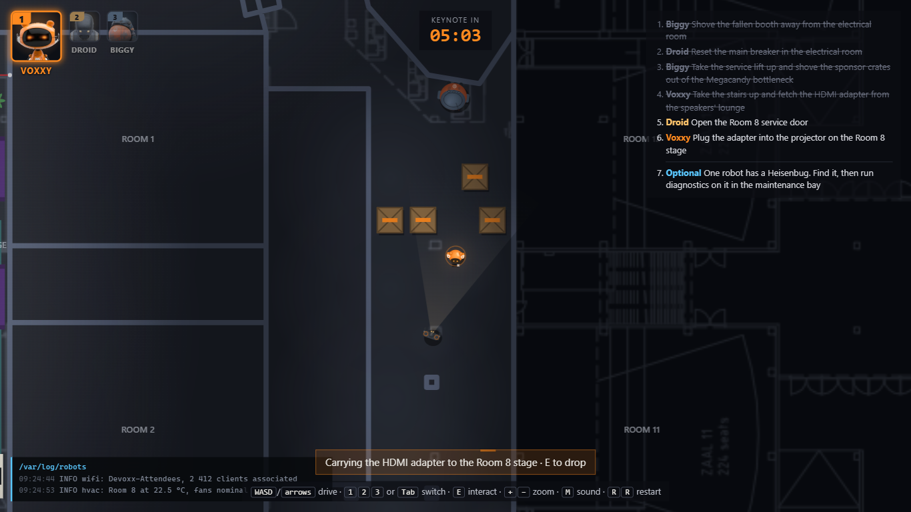
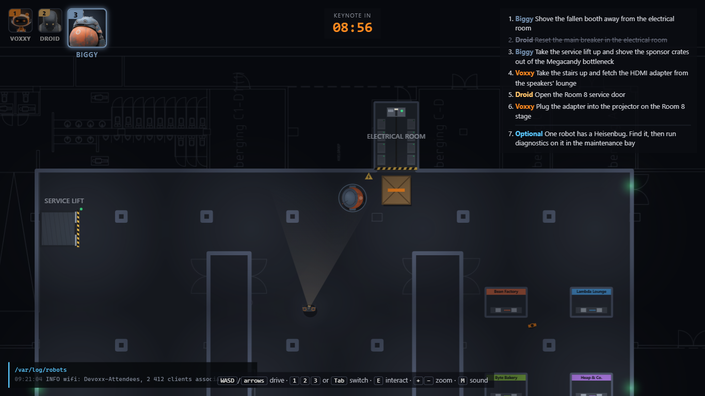
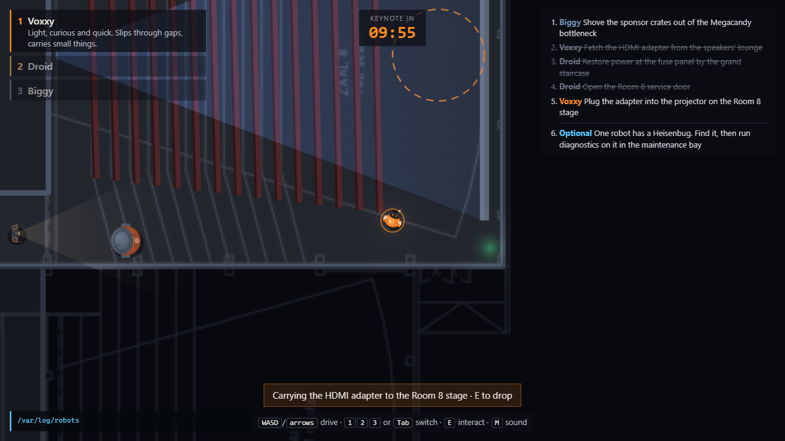

# Heisenbug: Keynote in 10

A browser game for the [Devoxx Belgium 2026 Robot Games](https://game.devoxx.be/) competition.

The keynote in Room 8 at Kinepolis Antwerp starts in ten minutes, the power is out and the
speaker's HDMI adapter is on the wrong side of the building. Three robots have to fix it together —
and one of them has a glitch nobody has diagnosed yet.



## The mission

The keynote clock counts down from 10:00 (seven and a half minutes of real time). Everything has to be
done by the three robots together. They spent the night parked in the **exhibition hall** on the
ground floor:

1. A sponsor booth has toppled against the electrical room. **Biggy** shoves it away — nobody
   else can move it.
2. **Droid** resets the tripped main breaker. Until then the service lift, the ceiling lamps and
   Room 8 upstairs are dead.
3. **Biggy** cannot take the stairs, so it rides the now-working **service lift** up to the cinema
   floor and rams the wall of sponsor crates out of the Megacandy bottleneck, the only way from the
   corridor to the foyer. Voxxy and Droid are too light to move a crate at all.
4. **Voxxy** takes the stairs up, squeezes between the queue barriers of the speakers' lounge (too
   narrow for the other two) and picks up the speaker's HDMI adapter.
5. **Droid** opens the Room 8 service door.
6. **Voxxy** carries the adapter onto the Room 8 stage. The projector starts, you win.

If the clock reaches zero first, the keynote starts in the dark.



### The Heisenbug

One of the three robots — a different one every run — has a bug nobody has diagnosed yet. Every
so often it misbehaves: steering flips left/right, a sensor blackout drops its commands, the
throttle latches after you let go, or, while you are driving someone else, it twitches on its own.
The glitches get more frequent as the morning goes on.

The system log in the corner reports every symptom but never says *which* unit it was — you have to
work that out from what you see. Drive your suspect into **Droid's old maintenance bay** (downstairs
in the exhibition hall, just south of where the robots start) and press <kbd>E</kbd> for a three-second self-test. Right, and
the glitches stop for good. Wrong, and the keynote clock loses 30 seconds. Finding it is optional —
the end screen tells you who it was either way.

## Play

- **Live:** https://deii.github.io/devoxx-belgium-2026-game/
- **Locally:** clone the repository and serve the folder with any static file server, then open it
  in a browser:

  ```bash
  git clone https://github.com/deii/devoxx-belgium-2026-game.git
  cd devoxx-belgium-2026-game
  npx serve .          # or: python -m http.server 8000
  ```

  ES modules do not load from `file://`, so opening `index.html` directly will not work.

No build step, no dependencies — plain HTML, CSS and JavaScript on a 2D canvas.

### Tests

```bash
npm test             # or: node --test test/*.test.js   (Node 22+, nothing to install)
```

The tests play the real level headlessly: the lift refuses to move without power, Biggy cannot take
the stairs, the crates stop Voxxy and Droid,
ramming the fallen booth head-on cannot wedge it into the electrical room, a full run from the exhibition hall to the crates
upstairs, every robot can reach what it needs in the hall, only Voxxy fits into the speakers' lounge,
people never walk through walls, and the Heisenbug's self-test.

## The robots

| Robot | Role |
|-------|------|
| **Voxxy** | Light and quick. Slips through the crowd and carries the adapter. |
| **Droid** | Has been in this building for years. Opens service doors, restores power, lights the way. |
| **Biggy** | Heavy and hard to stop. Pushes crates and forces jammed doors — but cannot take the stairs. |

## Their idols

Every robot looks up to a Devoxx speaker whose strengths it shares, and reacts to what happens in
speech bubbles — in its own words:

- **Voxxy** idolises **Josh Long** — nobody gets from slide to live demo faster. Voxxy borrows his
  "Bootiful" whenever something goes right.
- **Droid** idolises **Dr. Venkat Subramaniam** — decades of making hard things clear. Droid tries
  to light the way for others the same way.
- **Biggy** idolises **Victor Rentea** — once he starts refactoring, nothing in the way survives.
  Biggy feels the same about crates.

Robot-history fans should drive each robot past the wall of fame in the foyer at least once.

Bumping into walls or into each other winds the robots up. Every hard bump raises a robot's
frustration (its portrait frame turns amber, then red and shaking) and it complains — politely at first,
less so the angrier it gets. Frustration cools down after about 25 seconds without crashes.

This is an affectionate fan tribute written for the competition. The speakers are not involved in
or affiliated with this game, and apart from the well-known "Bootiful" no line in it is theirs.

## Controls

| Key | Action |
|-----|--------|
| <kbd>W</kbd><kbd>A</kbd><kbd>S</kbd><kbd>D</kbd> or arrow keys | Drive the selected robot |
| <kbd>1</kbd> <kbd>2</kbd> <kbd>3</kbd> or <kbd>Tab</kbd> | Switch between Voxxy, Droid and Biggy |
| <kbd>E</kbd> or <kbd>Space</kbd> | Interact (pick up / drop, stairs, lift, main breaker, service door) |
| <kbd>Enter</kbd> / <kbd>R</kbd> | Start / play again |
| <kbd>R</kbd> <kbd>R</kbd> | Restart during a run (press twice) |
| <kbd>+</kbd> / <kbd>−</kbd> or mouse wheel, <kbd>0</kbd> | Zoom in / out, reset zoom |
| <kbd>M</kbd> | Sound on / off |

Your best time is remembered in this browser (`localStorage`) and shown on the title screen.

The robots are physically simulated: each has its own mass, motor force, turning speed and grip.
Voxxy reaches 4.5 m/s in about a second and skids in tight turns; Biggy needs five seconds to get
up to speed, coasts for two metres after you let go, and knocks Voxxy aside on contact.

## Light and weight

The morning starts without power. The exhibition hall and the central corridor upstairs have
only green exit signs and emergency lights, daylight falls through the glass facade of the foyer,
and Room 8 is pitch black.
Droid's amber eyes are a real torch, Voxxy's visor glows. Resetting the main breaker downstairs brings the
ceiling lamps back with a fluorescent flicker, turns on Room 8's house lights and starts the
projector — a blue "no signal" beam until the adapter is plugged in.



People are around, too: early attendees in the foyer and corridor, crew setting up the booths and
the stage, a speaker rehearsing in the lounge. They do not block the robots — they wander, stand
around, and have something to say when a robot rolls up ("Biggy! Mind my toes!").

The exhibition hall is full of (made-up) sponsor booths, the foyer has its coffee bar and bean
bags, and the robots are animated: Voxxy blinks and looks into turns, Droid walks and scans the room
with its torch, Biggy waddles.

Weight is visible, too: Voxxy kicks up dust when it skids, Biggy's footfalls puff dust and nudge
the camera, and every hard impact shakes the view in proportion to mass × speed. Room 8's seat rows
are solid: robots reach the stage through the side aisles, the way people do.

## Sound

All sound but one is synthesised with the Web Audio API. Each robot has a motor
voice whose pitch and volume follow its speed (Voxxy whines, Droid's servos buzz, Biggy growls).
Two detuned oscillators beat against each other, the tone strains when a motor pulls harder than
it moves and bends when it turns, the volume pulses with wheel turns, servo steps or footfalls, and
the pitch drifts a little, so even top speed never settles into one flat drone.
Biggy's footfalls thud, crates scrape, and every collision sounds like what was hit: a metallic
clang off walls, a hollow two-tone bonk between robots, a dull thud on crates — louder for heavier
robots and harder hits. The one exception: when Biggy takes the service lift, it
rides to the classic elevator-music meme, Kevin MacLeod's "Local Forecast – Elevator", and the lift
dings on arrival. Winning plays a short 8-bit stage-clear fanfare: an original tune written in the
style of classic platformer level-end jingles, synthesised like everything else. Browsers start audio only after a key press; <kbd>M</kbd> toggles sound.

## How generative AI was used

See [docs/GENAI.md](docs/GENAI.md) for how the tool was directed, and
[docs/PROMPTS.md](docs/PROMPTS.md) for every prompt, verbatim.

## Credits

- Robot designs based on the Devoxx Robot Games model sheets. The robot pictures on the title screen
  (`assets/robots/`) are front views cropped from those sheets, which Devoxx provides to entrants on
  the [references](https://game.devoxx.be/references.html) page.
- Venue layout traced from the Kinepolis Antwerp cinema-floor plan provided by Devoxx
  ([references](https://game.devoxx.be/references.html)); the plan itself is shown as a faint
  overlay (`assets/cinema-floor-plan.png`).
- The exhibition hall is traced from the "Hollywood" ground-floor plan from the same references
  (`assets/exhibition-hall-plan.png`). The plan has no scale; 4.15 cm per pixel gives the hall its
  2 400 m² and the same 6.5 m pillar grid as upstairs. One pillar in front of the electrical room is
  left out so Biggy has room to push the booth.
- Elevator music: "Local Forecast – Elevator" by Kevin MacLeod ([incompetech.com](https://incompetech.com)),
  licensed under [Creative Commons: By Attribution 4.0](https://creativecommons.org/licenses/by/4.0/).
  Trimmed to the first 24 seconds (`assets/audio/local-forecast-elevator.mp3`).

## License

[MIT](LICENSE) — except the elevator music in `assets/audio/`, which is Kevin MacLeod's and stays
under CC BY 4.0, and the robot pictures in `assets/robots/` and the floor plans in `assets/`,
which are Devoxx material (see Credits).
